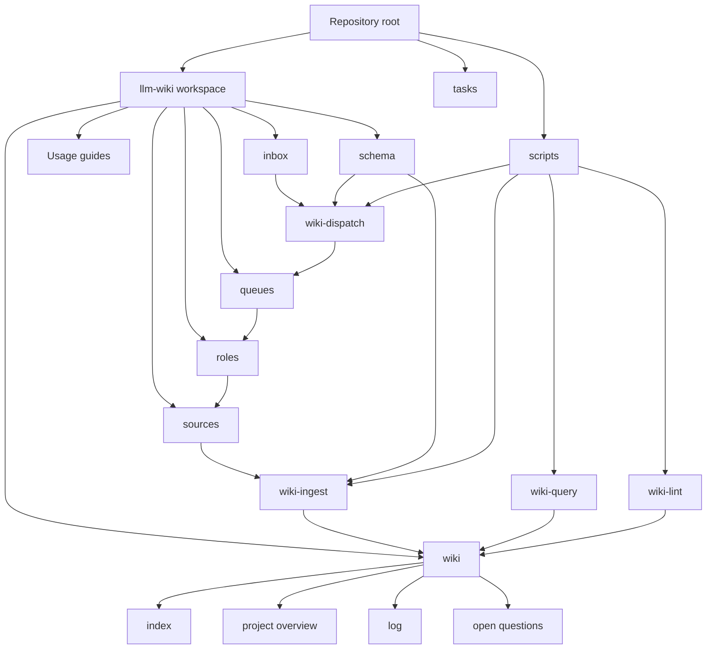

# llm-wiki

This repository is a markdown-first knowledge base built around an `llm-wiki` workflow.

이 저장소는 `llm-wiki` 워크플로우를 기반으로 한 마크다운 중심 지식베이스입니다.

## 폴더 구조도



## 한국어 문서 지도

처음 보는 경우에는 [llm-wiki/USAGE.ko.md](llm-wiki/USAGE.ko.md)를 먼저 읽으면 됩니다. 아래 표는 각 폴더가 맡는 기능과 그 기능을 설명하는 마크다운 파일을 연결한 지도입니다.

| 폴더 | 기능 | 관련 설명 문서 |
| --- | --- | --- |
| `.` | 저장소 루트입니다. 전체 안내, 에이전트 작업 규칙, `make` 명령 진입점을 둡니다. | [README.md](README.md), [AGENTS.md](AGENTS.md) |
| `llm-wiki/` | 지식베이스의 본체입니다. 사용 가이드와 하위 폴더 전체를 묶는 상위 설명을 둡니다. | [llm-wiki/README.md](llm-wiki/README.md), [llm-wiki/USAGE.ko.md](llm-wiki/USAGE.ko.md), [llm-wiki/USAGE.md](llm-wiki/USAGE.md) |
| `llm-wiki/inbox/` | 새 자료를 먼저 떨어뜨리는 임시 접수함입니다. `make wiki-dispatch`가 이 폴더를 읽어 역할별 큐를 만듭니다. | [llm-wiki/inbox/README.md](llm-wiki/inbox/README.md) |
| `llm-wiki/sources/` | 채택된 원본 자료를 변경하지 않고 보관하는 불변 source archive입니다. | [llm-wiki/sources/README.md](llm-wiki/sources/README.md) |
| `llm-wiki/wiki/` | 실제로 합성되고 유지되는 지식 레이어입니다. 인덱스, 개요, 작업 로그, 열린 질문을 보관합니다. | [llm-wiki/wiki/index.md](llm-wiki/wiki/index.md), [llm-wiki/wiki/project-overview.md](llm-wiki/wiki/project-overview.md), [llm-wiki/wiki/log.md](llm-wiki/wiki/log.md), [llm-wiki/wiki/open-questions.md](llm-wiki/wiki/open-questions.md) |
| `llm-wiki/schema/` | 위키를 어떻게 ingest, query, lint, route 할지 정의하는 규칙과 템플릿입니다. | [llm-wiki/schema/workflow.md](llm-wiki/schema/workflow.md), [llm-wiki/schema/role-routing.md](llm-wiki/schema/role-routing.md), [llm-wiki/schema/page-template.md](llm-wiki/schema/page-template.md) |
| `llm-wiki/roles/` | 역할 기반 워크플로우의 책임 범위를 정의합니다. 한국어와 영어 역할 문서가 함께 있습니다. | [collector.ko.md](llm-wiki/roles/collector.ko.md), [synthesizer.ko.md](llm-wiki/roles/synthesizer.ko.md), [linker.ko.md](llm-wiki/roles/linker.ko.md), [critic.ko.md](llm-wiki/roles/critic.ko.md), [publisher.ko.md](llm-wiki/roles/publisher.ko.md) |
| `llm-wiki/queues/` | `make wiki-dispatch`가 생성하거나 갱신하는 역할별 작업 큐입니다. inbox 파일별 다음 행동을 보여줍니다. | [llm-wiki/queues/README.md](llm-wiki/queues/README.md), [dispatch-report.md](llm-wiki/queues/dispatch-report.md), [collector.md](llm-wiki/queues/collector.md), [synthesizer.md](llm-wiki/queues/synthesizer.md), [linker.md](llm-wiki/queues/linker.md), [critic.md](llm-wiki/queues/critic.md), [publisher.md](llm-wiki/queues/publisher.md) |
| `scripts/` | 위키 운영 명령의 실제 파이썬 구현입니다. ingest, query, lint, dispatch를 처리합니다. | [wiki_common.py](scripts/wiki_common.py), [wiki_ingest.py](scripts/wiki_ingest.py), [wiki_query.py](scripts/wiki_query.py), [wiki_lint.py](scripts/wiki_lint.py), [wiki_dispatch.py](scripts/wiki_dispatch.py) |
| `tasks/` | 에이전트 작업 계획, 진행 상황, 회고와 교훈을 기록하는 운영 메모입니다. | [tasks/todo.md](tasks/todo.md), [tasks/lessons.md](tasks/lessons.md) |

## 한국어 기준 읽는 순서

1. [llm-wiki/USAGE.ko.md](llm-wiki/USAGE.ko.md): 실제 사용 흐름을 먼저 파악합니다.
2. [llm-wiki/wiki/index.md](llm-wiki/wiki/index.md): 현재 유지되는 지식 페이지를 찾습니다.
3. [llm-wiki/schema/workflow.md](llm-wiki/schema/workflow.md): `ingest`, `query`, `lint` 명령이 무엇을 보장하는지 확인합니다.
4. [llm-wiki/schema/role-routing.md](llm-wiki/schema/role-routing.md): `inbox -> queues -> roles` 흐름을 사용할 때 읽습니다.
5. [llm-wiki/roles/collector.ko.md](llm-wiki/roles/collector.ko.md)부터 [publisher.ko.md](llm-wiki/roles/publisher.ko.md)까지: 역할별 책임을 확인합니다.
6. [llm-wiki/wiki/log.md](llm-wiki/wiki/log.md)와 [llm-wiki/wiki/open-questions.md](llm-wiki/wiki/open-questions.md): 최근 작업과 남은 불확실성을 확인합니다.

## 주요 명령

```bash
make wiki-dispatch
make wiki-ingest SRC=/absolute/path/to/source.md TITLE="Readable Title"
make wiki-query Q="keyword"
make wiki-lint
```

## English Documentation Map

If you are new to the repository, start with [llm-wiki/USAGE.md](llm-wiki/USAGE.md). The table below maps each folder to its purpose and to the markdown or source files that explain that purpose.

| Folder | Purpose | Related docs |
| --- | --- | --- |
| `.` | Repository root. Holds the top-level guide, agent rules, and `make` command entrypoints. | [README.md](README.md), [AGENTS.md](AGENTS.md) |
| `llm-wiki/` | Main knowledge-base workspace. Holds usage guides and the top-level explanation for the internal layout. | [llm-wiki/README.md](llm-wiki/README.md), [llm-wiki/USAGE.md](llm-wiki/USAGE.md), [llm-wiki/USAGE.ko.md](llm-wiki/USAGE.ko.md) |
| `llm-wiki/inbox/` | Temporary intake folder for new materials. `make wiki-dispatch` reads this folder and creates role queues. | [llm-wiki/inbox/README.md](llm-wiki/inbox/README.md) |
| `llm-wiki/sources/` | Immutable archive for accepted raw source material. | [llm-wiki/sources/README.md](llm-wiki/sources/README.md) |
| `llm-wiki/wiki/` | Maintained knowledge layer. Stores the catalog, overview, operational log, and open questions. | [llm-wiki/wiki/index.md](llm-wiki/wiki/index.md), [llm-wiki/wiki/project-overview.md](llm-wiki/wiki/project-overview.md), [llm-wiki/wiki/log.md](llm-wiki/wiki/log.md), [llm-wiki/wiki/open-questions.md](llm-wiki/wiki/open-questions.md) |
| `llm-wiki/schema/` | Workflow rules and templates for ingesting, querying, linting, routing, and shaping pages. | [llm-wiki/schema/workflow.md](llm-wiki/schema/workflow.md), [llm-wiki/schema/role-routing.md](llm-wiki/schema/role-routing.md), [llm-wiki/schema/page-template.md](llm-wiki/schema/page-template.md) |
| `llm-wiki/roles/` | Role definitions for the role-based workflow. English and Korean versions live side by side. | [collector.md](llm-wiki/roles/collector.md), [synthesizer.md](llm-wiki/roles/synthesizer.md), [linker.md](llm-wiki/roles/linker.md), [critic.md](llm-wiki/roles/critic.md), [publisher.md](llm-wiki/roles/publisher.md) |
| `llm-wiki/queues/` | Generated role queues from `make wiki-dispatch`. Each queue lists the next recommended action for inbox files. | [llm-wiki/queues/README.md](llm-wiki/queues/README.md), [dispatch-report.md](llm-wiki/queues/dispatch-report.md), [collector.md](llm-wiki/queues/collector.md), [synthesizer.md](llm-wiki/queues/synthesizer.md), [linker.md](llm-wiki/queues/linker.md), [critic.md](llm-wiki/queues/critic.md), [publisher.md](llm-wiki/queues/publisher.md) |
| `scripts/` | Python implementation for the wiki operations: ingest, query, lint, dispatch, and shared helpers. | [wiki_common.py](scripts/wiki_common.py), [wiki_ingest.py](scripts/wiki_ingest.py), [wiki_query.py](scripts/wiki_query.py), [wiki_lint.py](scripts/wiki_lint.py), [wiki_dispatch.py](scripts/wiki_dispatch.py) |
| `tasks/` | Operational notes for agent work: plans, progress, review notes, and lessons learned. | [tasks/todo.md](tasks/todo.md), [tasks/lessons.md](tasks/lessons.md) |

## English Reading Order

1. [llm-wiki/USAGE.md](llm-wiki/USAGE.md): learn the practical workflow first.
2. [llm-wiki/wiki/index.md](llm-wiki/wiki/index.md): find the maintained knowledge pages.
3. [llm-wiki/schema/workflow.md](llm-wiki/schema/workflow.md): understand the guarantees behind `ingest`, `query`, and `lint`.
4. [llm-wiki/schema/role-routing.md](llm-wiki/schema/role-routing.md): use this when following the `inbox -> queues -> roles` path.
5. [llm-wiki/roles/collector.md](llm-wiki/roles/collector.md) through [publisher.md](llm-wiki/roles/publisher.md): read role responsibilities.
6. [llm-wiki/wiki/log.md](llm-wiki/wiki/log.md) and [llm-wiki/wiki/open-questions.md](llm-wiki/wiki/open-questions.md): review recent operations and unresolved uncertainty.
